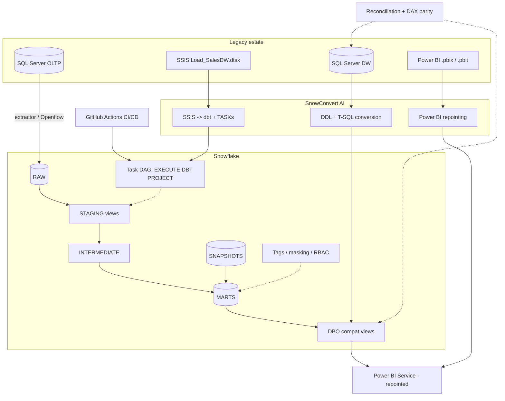

# Architecture

```mermaid
flowchart TB
  subgraph Legacy[Legacy estate]
    OLTP[(SQL Server OLTP)]
    SSIS[SSIS Load_SalesDW.dtsx]
    DW[(SQL Server DW)]
    PBI_OLD[Power BI .pbix / .pbit]
  end
  subgraph SC[SnowConvert AI]
    DDL[DDL + T-SQL conversion]
    ETL[SSIS -> dbt + TASKs]
    REP[Power BI repointing]
  end
  subgraph SF[Snowflake]
    RAW[(RAW)] --> STG[STAGING views] --> INT[INTERMEDIATE] --> MARTS[(MARTS)] --> DBO[DBO compat views]
    SNAP[(SNAPSHOTS)] --> MARTS
    TASKS[Task DAG: EXECUTE DBT PROJECT] -.-> STG
    GOV[Tags / masking / RBAC] -.-> MARTS
  end
  OLTP -->|extractor / Openflow| RAW
  SSIS --> ETL --> TASKS
  DW --> DDL --> DBO
  PBI_OLD --> REP --> PBI_NEW[Power BI Service - repointed]
  DBO --> PBI_NEW
  GH[GitHub Actions CI/CD] --> TASKS
  RECON[Reconciliation + DAX parity] -.-> DW
  RECON -.-> DBO
```

Key principle: dbt owns a modern model; the `DBO` compatibility views are the stable contract
that SnowConvert-repointed reports bind to, so the BI layer never needs a rebuild.
